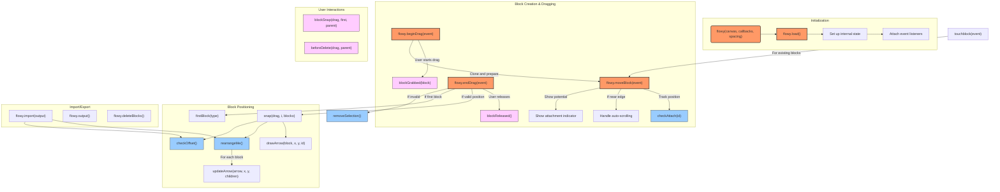

```mermaid
flowchart TD
    subgraph Initialization
        flowy("flowy(canvas, callbacks, spacing)")
        flowy --> load["flowy.load()"]
        load --> setupState["Set up internal state"]
        setupState --> attachListeners["Attach event listeners"]
    end

    subgraph "Block Creation & Dragging"
        beginDrag["flowy.beginDrag(event)"]
        moveBlock["flowy.moveBlock(event)"]
        endDrag["flowy.endDrag(event)"]
        
        beginDrag --> |"User starts drag"| blockGrabbed
        beginDrag --> |"Clone and prepare"| moveBlock
        moveBlock --> |"Track position"| checkAttach
        moveBlock --> |"If near edge"| autoScroll["Handle auto-scrolling"]
        moveBlock --> |"Show potential"| indicator["Show attachment indicator"]
        endDrag --> |"User releases"| blockReleased
    end

    subgraph "Block Positioning"
        checkAttach["checkAttach(id)"]
        firstBlock["firstBlock(type)"]
        snap["snap(drag, i, blocko)"]
        drawArrow["drawArrow(block, x, y, id)"]
        updateArrow["updateArrow(arrow, x, y, children)"]
        rearrangeMe["rearrangeMe()"]
        checkOffset["checkOffset()"]
    end

    endDrag --> |"If valid position"| snap
    endDrag --> |"If first block"| firstBlock
    endDrag --> |"If invalid"| removeSelection["removeSelection()"]
    
    snap --> drawArrow
    snap --> rearrangeMe
    snap --> checkOffset
    
    rearrangeMe --> |"For each block"| updateArrow
    
    subgraph "User Interactions"
        blockGrabbed["blockGrabbed(block)"]
        blockReleased["blockReleased()"]
        blockSnap["blockSnap(drag, first, parent)"]
        beforeDelete["beforeDelete(drag, parent)"]
    end
    
    subgraph "Import/Export"
        importFlow["flowy.import(output)"]
        outputFlow["flowy.output()"]
        deleteBlocks["flowy.deleteBlocks()"]
    end
    
    importFlow --> rearrangeMe
    importFlow --> checkOffset
    
    touchblock["touchblock(event)"] --> |"For existing blocks"| moveBlock
    
    classDef main fill:#f96,stroke:#333,stroke-width:2px;
    classDef utility fill:#9cf,stroke:#333,stroke-width:1px;
    classDef callback fill:#fcf,stroke:#333,stroke-width:1px;
    
    class flowy,load,beginDrag,moveBlock,endDrag main;
    class checkAttach,removeSelection,hasParentClass,checkOffset,rearrangeMe utility;
    class blockGrabbed,blockReleased,blockSnap,beforeDelete callback;
```
